# Évaluation Git & GitHub
Projet réalisé dans le cadre d'une évaluation Git & GitHub.
## Auteur : Chiara
## Technologies utilisées
- HTML
- CSS
- Git
- GitHub

# Partie 1 - Git en local

Création du projet : 
cd git-github-evaluation
git init
git status

Premier fichier et premier commit:
git add README.md
git status
git commit -m "add readme"

Ajout de fichiers et commits multiples:
git status

git add index.html style.css
git commit -m "add index & style"

Gestion de l'historique et correction de commits:
git add README.md
git diff --staged
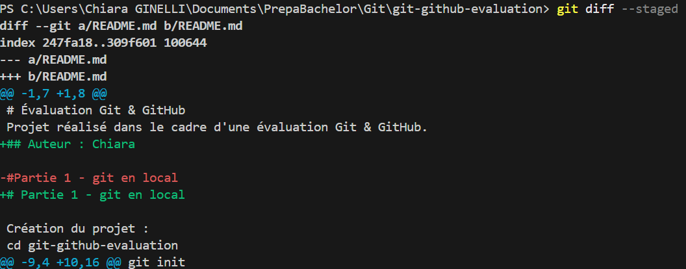
git commit -m "add author readme"
git log --oneline
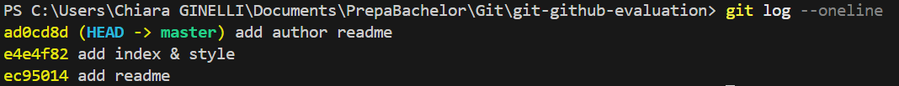
git show HEAD
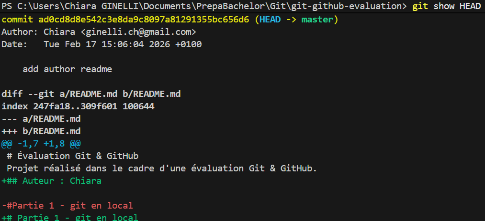

Travail avec les branches:
git checkout -b feature/ajout-style
git branch
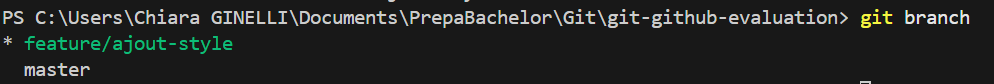
git add style.css
git commit -m "improve style"
git checkout master
git merge feature/ajout-style
git branch -d feature/ajout-style
git log --oneline --graph
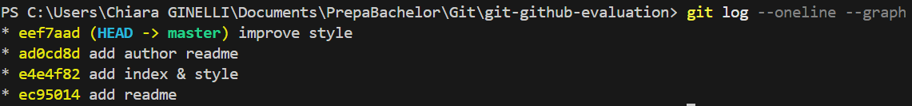

# Partie 2 - Github

Création du dépôt GitHub:
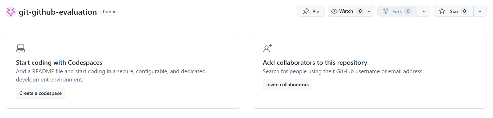

Lien entre dépôt local et distant:
git remote add origin https://github.com/ChiaraGinelli/git-github-evaluation.git
git remote -v
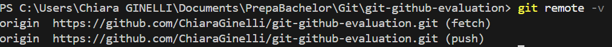

Envoi du projet sur GitHub:
git push -u origin master
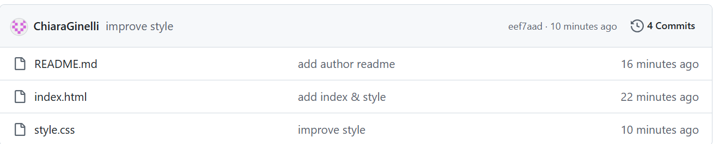

Gestion des branches distantes:
git checkout -b feature/page-contact
git add contact.html
git commit -m "add contact page"
git push -u origin feature/page-contact
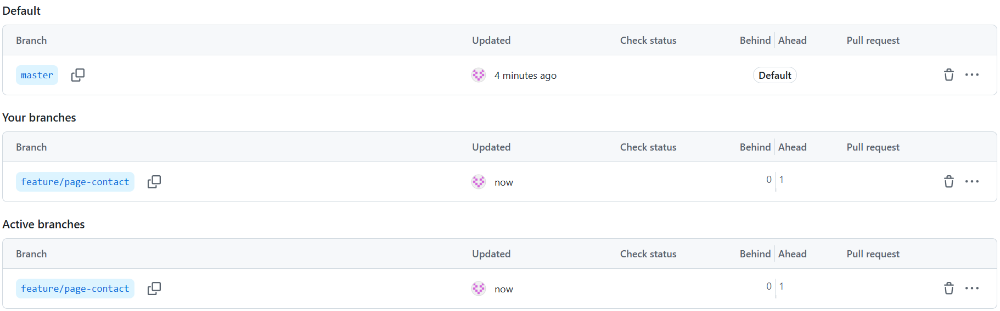
git checkout master
git merge feature/page-contact
git push
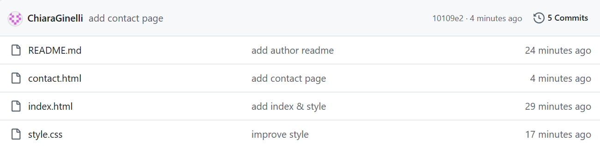
git push origin --delete feature/page-contact
git log --oneline --graph
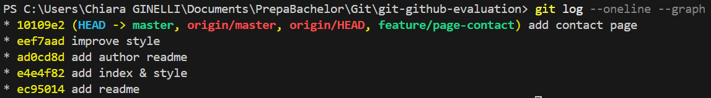

Pull Request & GitHub Flow:
git checkout -b feature/amelioration-readme
