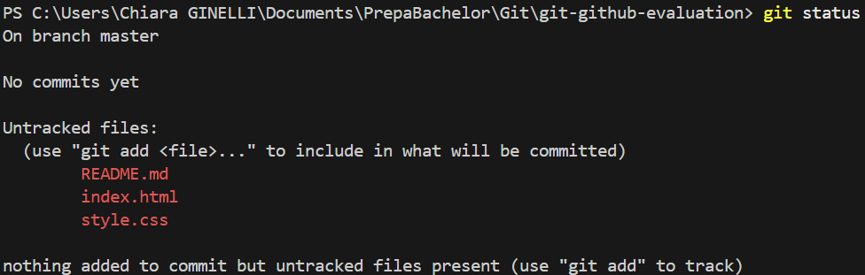
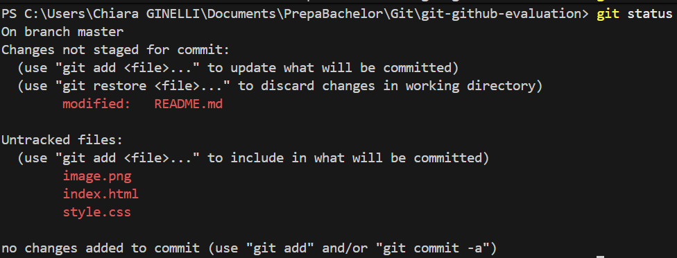
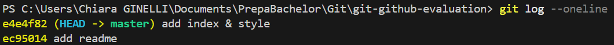

# Évaluation Git & GitHub
Projet réalisé dans le cadre d'une évaluation Git & GitHub.
## Auteur : Chiara

# Partie 1 - git en local

Création du projet : 
cd git-github-evaluation
git init
git status

Premier fichier et premier commit:
git add README.md
git status
git commit -m "add readme"

Ajout de fichiers et commits multiples:
git status

git add index.html style.css
git commit -m "add index & style"

Gestion de l'historique et correction de commits: